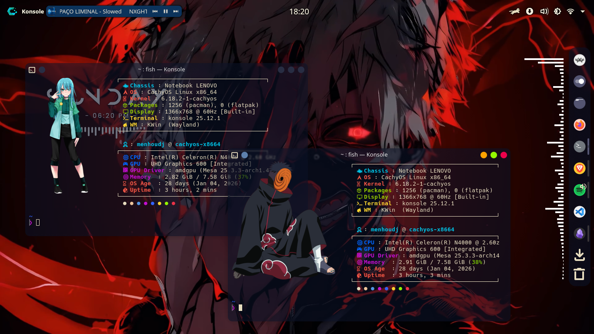
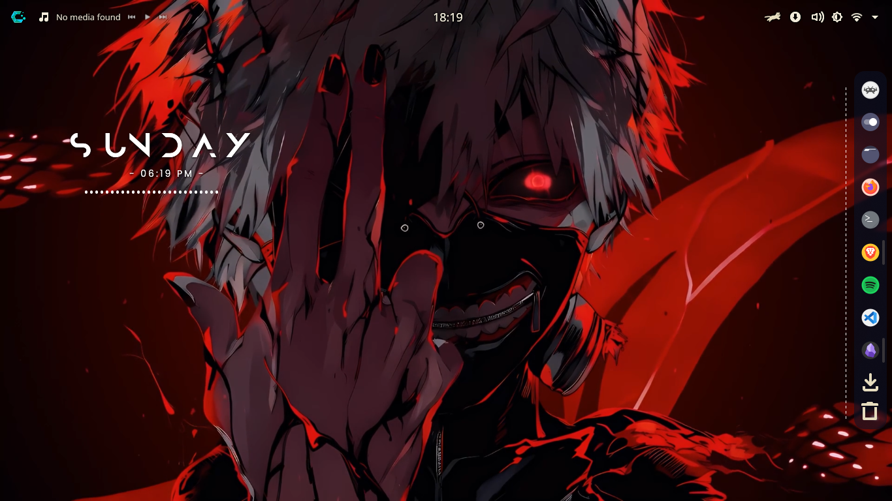
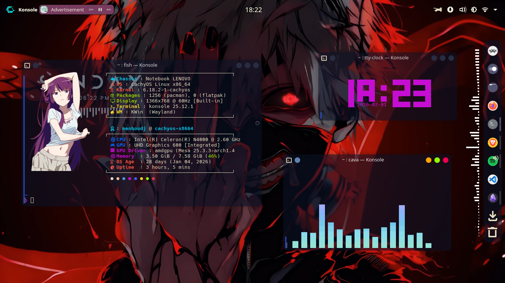
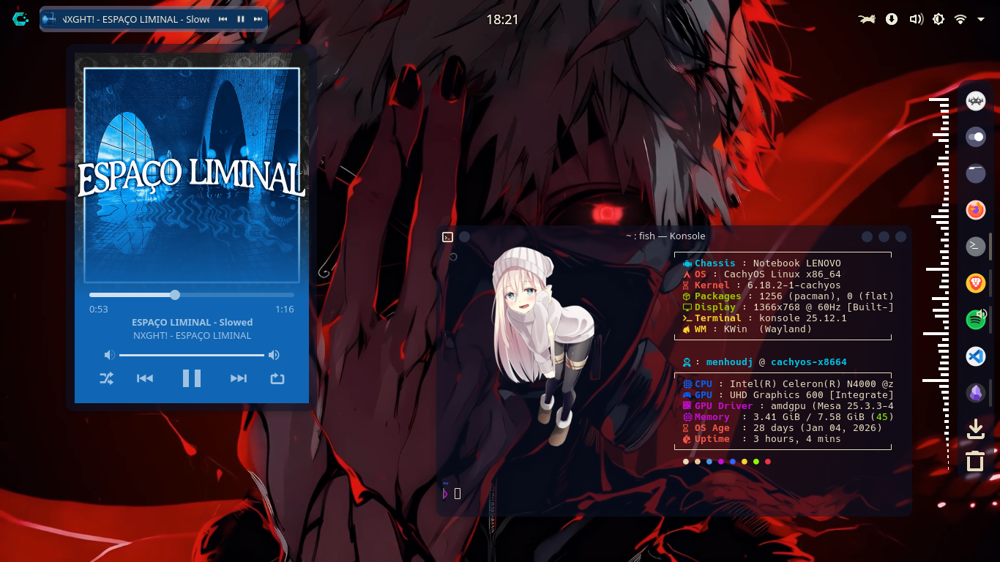
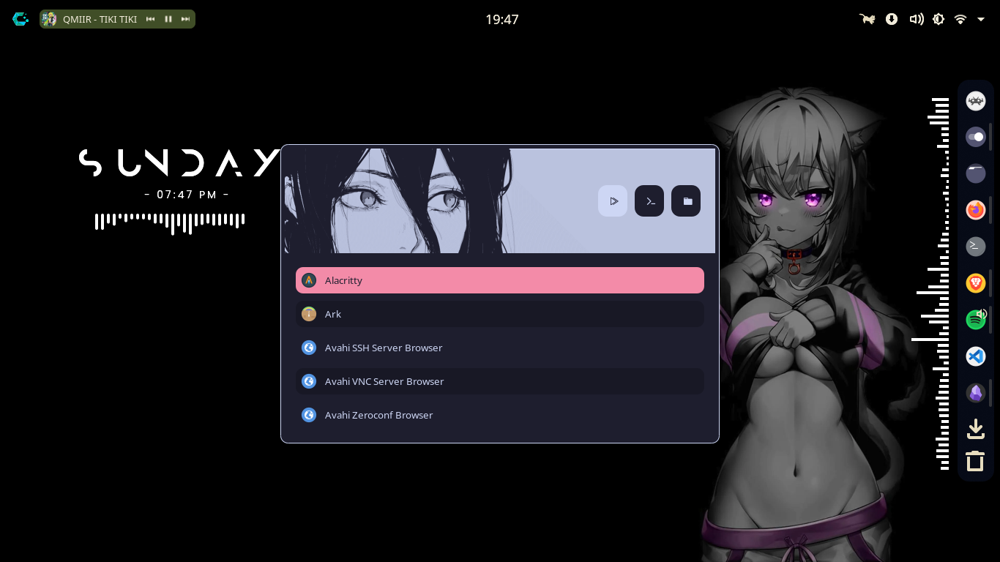

# Hi 👋, this is my CachyOS setup (Dotfiles)

This repository contains my **CachyOS setup dotfiles**.  
The README file also serves as an **installation guide**.  
I hope you enjoy it 😊

---

## 👾 Setup Applications
- Brave
- VS Code
- Obsidian
- Fastfetch
- Rofi
- Neovim (nvim)
- Cava
- TTY Clock
- Spotify
- Kvantum
- OBS
- GPU Screen Recorder

---

## 💫 Themes, Icons, and Configs
- **Rofi theme**: You will find it inside the dotfiles folder
- **KDE theme**: Utterly Sweet theme & Utterly Sweet Kvantum theme
- **Icons**: Tela Circle
- **Fastfetch config**:  
  https://github.com/menhoudj/my-fastfetch-config
- **Wallpapers**:  
  https://github.com/menhoudj/cachyos-wallpaper
- **Live wallpaper**:  
  https://drive.google.com/file/d/1H8gwkYX6Tf4rDtWlbYmjG-cupc9IM1VJ/view
- Go to **Window Rules** and create a new rule with **No title bar**

---

## 🪟 KDE Widgets and Window Effects
### Widgets
- CatWalk
- KDE Control Station
- System Tray
- Digital Clock
- Modern Clock
- Kurve
- Simple Application Launcher
- Panel Spacer
- Separator
- Window Title
- PlasMusic Toolbar
- Emulator Spectrum
- Folder View
- Trash
- Toggle Overview + AppImageKit RetroArch icon
- Panel Colorizer
- Application Icons

### Window Effects
- Wobbly Windows
- Translucency
- Blur  
  - Blur strength: **1**  
  - Blur noise strength: **4**
- Rounded Corners  
  - `kwin-effect-rounded-corners-git` (AUR for Arch Linux)

---

## 🖼 System Theme Preview

| Picture 1 | Picture 2 |
|----------|----------|
|  |  |

| Picture 3 | Picture 4 |
|----------|----------|
|  |  |

---

## ✅ Application Checklist
- [ ] Brave
- [ ] VS Code
- [ ] Obsidian
- [ ] Fastfetch
- [ ] Rofi
- [ ] Neovim
- [ ] Cava
- [ ] TTY Clock
- [ ] Spotify
- [ ] Kvantum
- [ ] OBS
- [ ] GPU Screen Recorder
---
